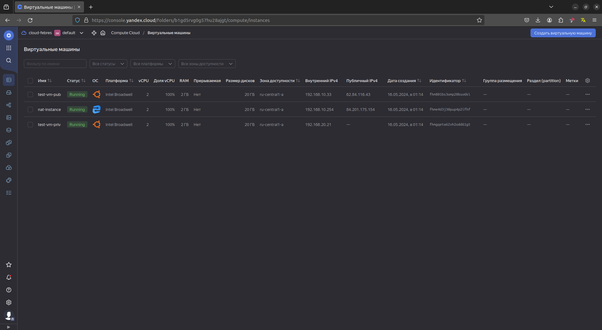

# Домашнее задание к занятию «Организация сети»

### Задание 1. Yandex Cloud 

**Что нужно сделать**

1. Создать пустую VPC. Выбрать зону.
2. Публичная подсеть.

 - Создать в VPC subnet с названием public, сетью 192.168.10.0/24.
 - Создать в этой подсети NAT-инстанс, присвоив ему адрес 192.168.10.254. В качестве image_id использовать fd80mrhj8fl2oe87o4e1.
 - Создать в этой публичной подсети виртуалку с публичным IP, подключиться к ней и убедиться, что есть доступ к интернету.
3. Приватная подсеть.
 - Создать в VPC subnet с названием private, сетью 192.168.20.0/24.
 - Создать route table. Добавить статический маршрут, направляющий весь исходящий трафик private сети в NAT-инстанс.
 - Создать в этой приватной подсети виртуалку с внутренним IP, подключиться к ней через виртуалку, созданную ранее, и убедиться, что есть доступ к интернету.

### Решение

Создадим манифест для terraform [main.tf](src1%2Fmain.tf)

 - VPC subnet с названием public, сетью 192.168.10.0/24
```
resource "yandex_vpc_network" "yc-vpc" {
  name        = "yc_vpc_network"    
}

resource "yandex_vpc_subnet" "yc-subnet-a" {
  name           = "public"
  description    = "public-net"
  v4_cidr_blocks = ["192.168.10.0/24"]
  zone                     = var.yandex_zone
  network_id     = "${yandex_vpc_network.yc-vpc.id}"
}
```

- NAT-инстанс, присвоив ему адрес 192.168.10.254. В качестве image_id использовать fd80mrhj8fl2oe87o4e1.
```
resource "yandex_compute_instance" "nat-instance" {
  name = "nat-instance"
  zone = var.yandex_zone
  resources {
    cores  = 2
    memory = 2
  }
  boot_disk {
    initialize_params {
      image_id = "fd80mrhj8fl2oe87o4e1"
      size     = 20
    }
  }
  network_interface {
    subnet_id = "${yandex_vpc_subnet.yc-subnet-a.id}"
    nat       = true
    ip_address = "192.168.10.254"
  }
  metadata = {
    user-data = data.template_file.cloud_init.rendered
  }
}
```

- Создадим VPC subnet с названием private, сетью 192.168.20.0/24 и таблицу маршрутизации
```
resource "yandex_vpc_subnet" "yc-subnet-b" {
  name           = "private"
  description    = "private-net"
  v4_cidr_blocks = ["192.168.20.0/24"]
  zone                     = var.yandex_zone
  network_id     = "${yandex_vpc_network.yc-vpc.id}"
  route_table_id = yandex_vpc_route_table.yc-rt.id
}

resource "yandex_vpc_route_table" "yc-rt" {
  name       = "yc-rt"
  network_id = "${yandex_vpc_network.yc-vpc.id}"

  static_route {
    destination_prefix = "0.0.0.0/0"
    next_hop_address   = "192.168.10.254"
  }
}
```

- Создадим виртуалку с публичным IP
```
resource "yandex_compute_instance" "test-vm-pub" {
  name = "test-vm-pub"
  zone = var.yandex_zone
  resources {
    cores  = 2
    memory = 2
  }
  boot_disk {
    initialize_params {
      image_id = var.iso_id
      size     = 20
    }
  }
  network_interface {
    subnet_id = "${yandex_vpc_subnet.yc-subnet-a.id}"
    nat       = true
  }
  metadata = {
    user-data = data.template_file.cloud_init.rendered
  }
  provisioner "file" {
    content = tls_private_key.ssh-key.private_key_pem
    destination = pathexpand(var.private_key_path)
    connection {
      type        = "ssh"
      host        = self.network_interface.0.nat_ip_address
      user        = var.user
      private_key = tls_private_key.ssh-key.private_key_openssh
    }
  }
  provisioner "remote-exec" {
    inline = [
      "chmod 600 /home/ifebres/.ssh/id_rsa",
    ]
    connection {
      type        = "ssh"
      host        = self.network_interface.0.nat_ip_address
      user        = var.user
      private_key = tls_private_key.ssh-key.private_key_openssh
    }
  }
}  
```

- Создадим виртуалку в приватной сети
```
resource "yandex_compute_instance" "test-vm-priv" {
  name = "test-vm-priv"
  zone = var.yandex_zone
  resources {
    cores  = 2
    memory = 2
  }
  boot_disk {
    initialize_params {
      image_id = var.iso_id
      size     = 20
    }
  }
  network_interface {
    subnet_id = "${yandex_vpc_subnet.yc-subnet-b.id}"
  }
  metadata = {
    user-data = data.template_file.cloud_init.rendered
  }
}
```

Применяем манифест
```commandline
ifebres@ifebres-nb:~/terraform/cloud$ terraform apply

Terraform used the selected providers to generate the following execution plan. Resource actions are indicated with the following symbols:
  + create
 <= read (data resources)

...
Plan: 9 to add, 0 to change, 0 to destroy.

Do you want to perform these actions?
  Terraform will perform the actions described above.
  Only 'yes' will be accepted to approve.

  Enter a value: yes

yandex_vpc_network.yc-vpc: Creating...
...
Apply complete! Resources: 9 added, 0 changed, 0 destroyed.
```

Проверяем 



Проверяем доступ в интернет с публичной ВМ
```commandline
ifebres@ifebres-nb:~/terraform/cloud$ ssh -i ./ssh_key ifebres@62.84.116.43

The authenticity of host '62.84.116.43 (62.84.116.43)' can't be established.
ED25519 key fingerprint is SHA256:I9AdFIvmVsFvAJV6YzIwcaIMd54DOxFl9jAWemcx1lw.
This key is not known by any other names
Are you sure you want to continue connecting (yes/no/[fingerprint])? yes
Warning: Permanently added '62.84.116.43' (ED25519) to the list of known hosts.
Welcome to Ubuntu 22.04.1 LTS (GNU/Linux 5.15.0-58-generic x86_64)

 * Documentation:  https://help.ubuntu.com
 * Management:     https://landscape.canonical.com
 * Support:        https://ubuntu.com/advantage

  System information as of Wed May 15 10:17:32 PM UTC 2024

  System load:  0.29443359375      Processes:             133
  Usage of /:   19.5% of 19.59GB   Users logged in:       0
  Memory usage: 9%                 IPv4 address for eth0: 192.168.10.33
  Swap usage:   0%

 * Strictly confined Kubernetes makes edge and IoT secure. Learn how MicroK8s
   just raised the bar for easy, resilient and secure K8s cluster deployment.

   https://ubuntu.com/engage/secure-kubernetes-at-the-edge

0 updates can be applied immediately.


The list of available updates is more than a week old.
To check for new updates run: sudo apt update

Last login: Wed May 15 22:15:18 2024 from 46.138.82.238
To run a command as administrator (user "root"), use "sudo <command>".
See "man sudo_root" for details.

ifebres@fhm801bs3omp20bso6ki:~$ ping ya.ru
PING ya.ru (5.255.255.242) 56(84) bytes of data.
64 bytes from ya.ru (5.255.255.242): icmp_seq=1 ttl=56 time=0.674 ms
64 bytes from ya.ru (5.255.255.242): icmp_seq=2 ttl=56 time=0.270 ms
64 bytes from ya.ru (5.255.255.242): icmp_seq=3 ttl=56 time=0.259 ms
^C
--- ya.ru ping statistics ---
3 packets transmitted, 3 received, 0% packet loss, time 2024ms
rtt min/avg/max/mdev = 0.259/0.401/0.674/0.193 ms
```

Проверяем доступ в интернет с приватной ВМ
```commandline
ifebres@fhm801bs3omp20bso6ki:~$ ssh 192.168.20.21
The authenticity of host '192.168.20.21 (192.168.20.21)' can't be established.
ED25519 key fingerprint is SHA256:avZnkPwkL7brDLeiHfSbhjuM/FtRbsumIYQyp48tJ0I.
This key is not known by any other names
Are you sure you want to continue connecting (yes/no/[fingerprint])? yes
Warning: Permanently added '192.168.20.21' (ED25519) to the list of known hosts.
Welcome to Ubuntu 22.04.1 LTS (GNU/Linux 5.15.0-58-generic x86_64)

 * Documentation:  https://help.ubuntu.com
 * Management:     https://landscape.canonical.com
 * Support:        https://ubuntu.com/advantage

  System information as of Wed May 15 10:19:28 PM UTC 2024

  System load:  0.02978515625      Processes:             135
  Usage of /:   19.8% of 19.59GB   Users logged in:       0
  Memory usage: 10%                IPv4 address for eth0: 192.168.20.21
  Swap usage:   0%

 * Strictly confined Kubernetes makes edge and IoT secure. Learn how MicroK8s
   just raised the bar for easy, resilient and secure K8s cluster deployment.

   https://ubuntu.com/engage/secure-kubernetes-at-the-edge

0 updates can be applied immediately.


The list of available updates is more than a week old.
To check for new updates run: sudo apt update


The programs included with the Ubuntu system are free software;
the exact distribution terms for each program are described in the
individual files in /usr/share/doc/*/copyright.

Ubuntu comes with ABSOLUTELY NO WARRANTY, to the extent permitted by
applicable law.

To run a command as administrator (user "root"), use "sudo <command>".
See "man sudo_root" for details.

ifebres@fhmgqeta62vh2odd61gt:~$ ping ya.ru
PING ya.ru (5.255.255.242) 56(84) bytes of data.
64 bytes from ya.ru (5.255.255.242): icmp_seq=1 ttl=52 time=1.93 ms
64 bytes from ya.ru (5.255.255.242): icmp_seq=2 ttl=52 time=0.750 ms
64 bytes from ya.ru (5.255.255.242): icmp_seq=3 ttl=52 time=0.773 ms
^C
--- ya.ru ping statistics ---
3 packets transmitted, 3 received, 0% packet loss, time 2003ms
rtt min/avg/max/mdev = 0.750/1.150/1.929/0.550 ms

```
