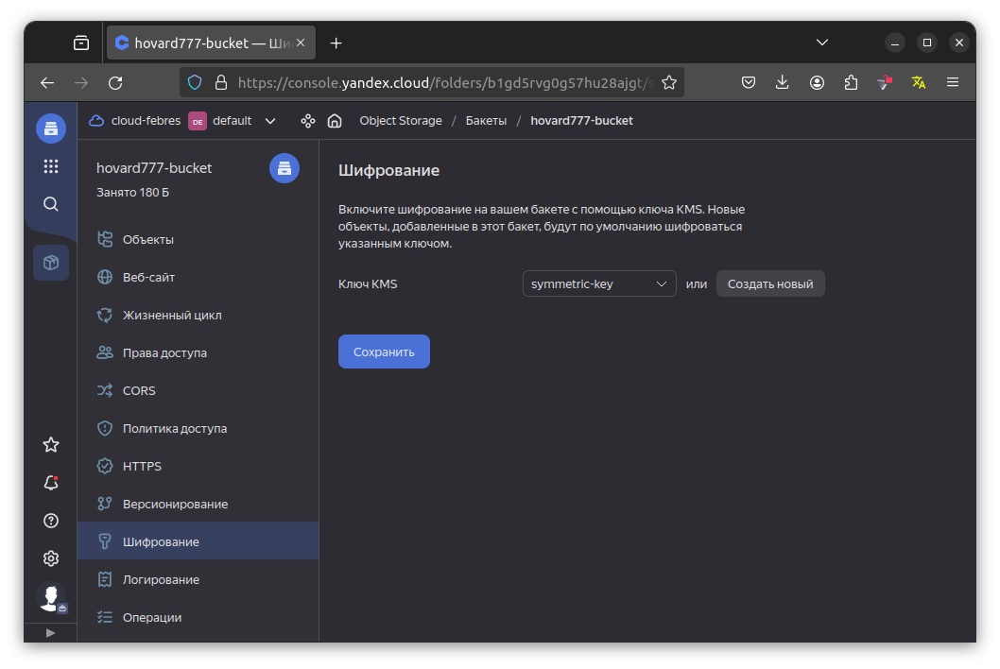
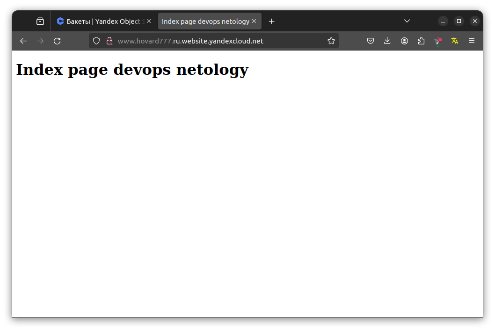

# Домашнее задание к занятию «Безопасность в облачных провайдерах»  

## Задание 1. Yandex Cloud   

1. С помощью ключа в KMS необходимо зашифровать содержимое бакета:

 - создать ключ в KMS;
 - с помощью ключа зашифровать содержимое бакета, созданного ранее.
2. (Выполняется не в Terraform)* Создать статический сайт в Object Storage c собственным публичным адресом и сделать доступным по HTTPS:

 - создать сертификат;
 - создать статическую страницу в Object Storage и применить сертификат HTTPS;
 - в качестве результата предоставить скриншот на страницу с сертификатом в заголовке (замочек).

### Решение
[backet.tf](src3%2Fbacket.tf)
[kms.tf](src3%2Fkms.tf)

1. Зашифровать бакет
 - создать ключ в KMS; 
```yaml
resource "yandex_kms_symmetric_key" "key-a" {
  name              = "symmetric-key"
  description       = "key for bucket encryption"
  default_algorithm = "AES_128"
  rotation_period   = "8760h" // equal to 1 year
}
```
 - с помощью ключа зашифровать содержимое бакета. 
```yaml
resource "yandex_storage_bucket" "bucket" {
  access_key = yandex_iam_service_account_static_access_key.sa-backet-static-key.access_key
  secret_key = yandex_iam_service_account_static_access_key.sa-backet-static-key.secret_key
  bucket     =  var.bucket_name 
  force_destroy = true
  acl        = "public-read"
  anonymous_access_flags {
    read        = true
    list        = true
    config_read = true
  }

  server_side_encryption_configuration {
    rule {
      apply_server_side_encryption_by_default {
        kms_master_key_id = yandex_kms_symmetric_key.key-a.id
        sse_algorithm     = "aws:kms"
      }
    }
  }
}
```
  Результат


2. Создал бакет www.howard777.ru c web-страницей
```yaml
resource "yandex_storage_bucket" "web_bucket" {
  access_key = yandex_iam_service_account_static_access_key.sa-backet-static-key.access_key
  secret_key = yandex_iam_service_account_static_access_key.sa-backet-static-key.secret_key
  bucket     = var.web_bucket_name
  force_destroy = true
  acl        = "public-read"
  anonymous_access_flags {
    read        = true
    list        = true
    config_read = true
  }

  website {
    index_document = "index.html"
  }
}
```

