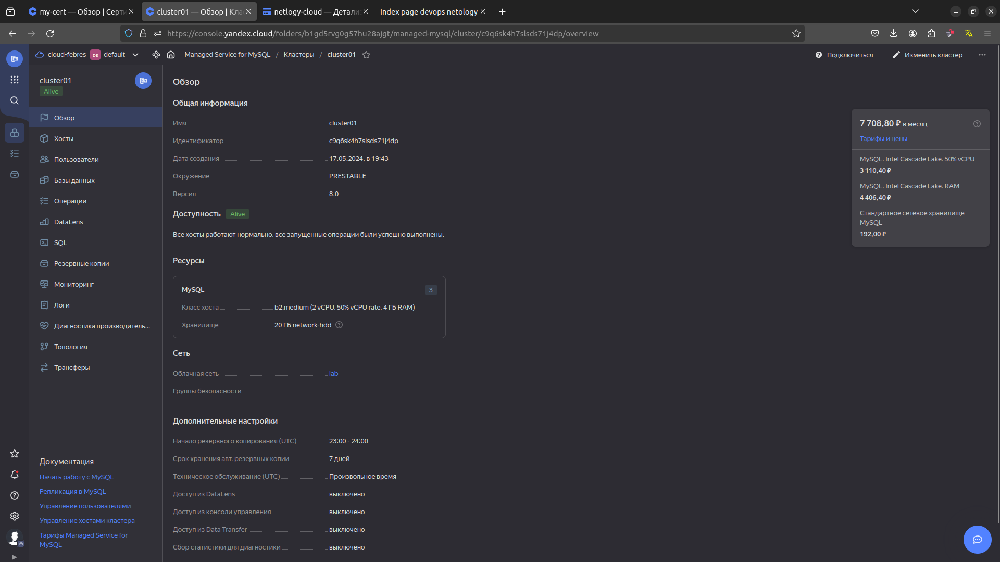
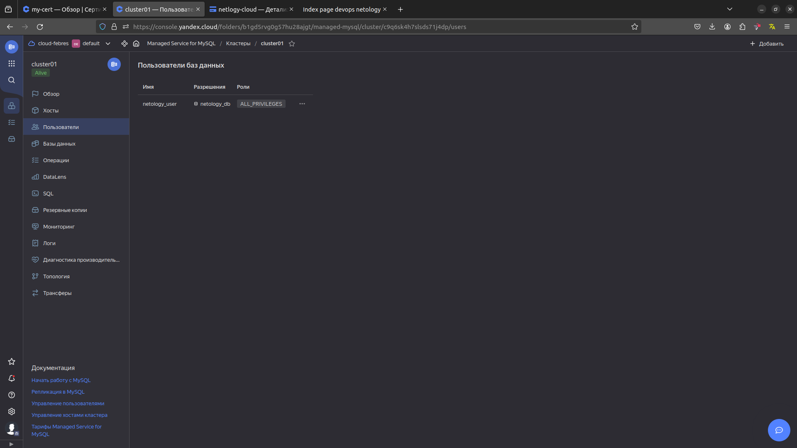
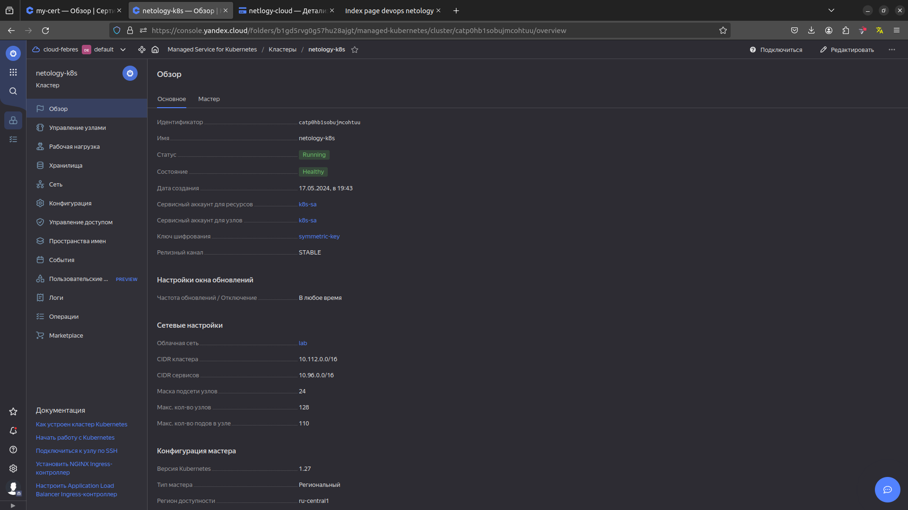
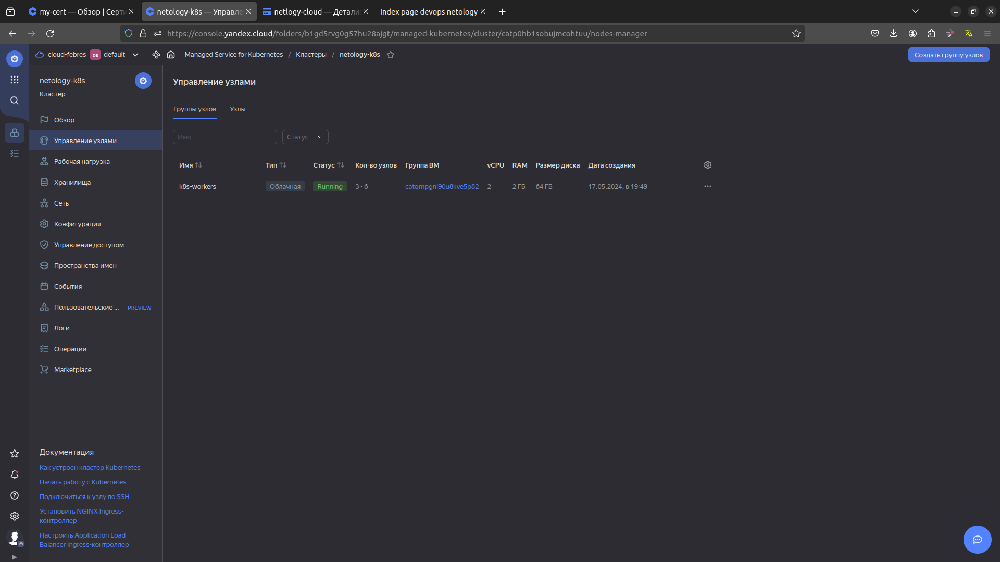
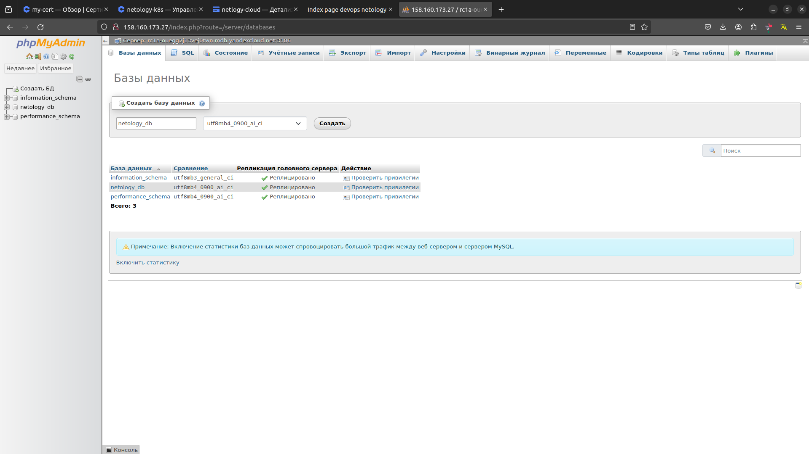

# Домашнее задание к занятию «Кластеры. Ресурсы под управлением облачных провайдеров»

### Цели задания 

1. Организация кластера Kubernetes и кластера баз данных MySQL в отказоустойчивой архитектуре.
2. Размещение в private подсетях кластера БД, а в public — кластера Kubernetes.

---
## Задание 1. Yandex Cloud

1. Настроить с помощью Terraform кластер баз данных MySQL.

 - Используя настройки VPC из предыдущих домашних заданий, добавить дополнительно подсеть private в разных зонах, чтобы обеспечить отказоустойчивость. 
 - Разместить ноды кластера MySQL в разных подсетях.
 - Необходимо предусмотреть репликацию с произвольным временем технического обслуживания.
 - Использовать окружение Prestable, платформу Intel Broadwell с производительностью 50% CPU и размером диска 20 Гб.
 - Задать время начала резервного копирования — 23:59.
 - Включить защиту кластера от непреднамеренного удаления.
 - Создать БД с именем `netology_db`, логином и паролем.

### Решение

- Создал приватные подсети [network.tf](src4%2Fnetwork.tf)
- Создал кластер MySQL, бд и пользователя [mysql.tf](src4%2Fmysql.tf). Использовал b2.medium, т.к. в зоне ru-central1-d нельзя использовать b1  





2. Настроить с помощью Terraform кластер Kubernetes.

 - Используя настройки VPC из предыдущих домашних заданий, добавить дополнительно две подсети public в разных зонах, чтобы обеспечить отказоустойчивость.
 - Создать отдельный сервис-аккаунт с необходимыми правами. 
 - Создать региональный мастер Kubernetes с размещением нод в трёх разных подсетях.
 - Добавить возможность шифрования ключом из KMS, созданным в предыдущем домашнем задании.
 - Создать группу узлов, состояющую из трёх машин с автомасштабированием до шести.
 - Подключиться к кластеру с помощью `kubectl`.
 - *Запустить микросервис phpmyadmin и подключиться к ранее созданной БД.
 - *Создать сервис-типы Load Balancer и подключиться к phpmyadmin. Предоставить скриншот с публичным адресом и подключением к БД.

### Решение

- Создал приватные подсети [network.tf](src4%2Fnetwork.tf)
- Создал сервисные аккаунты [sa.tf](src4%2Fsa.tf)
- Создал кластер k8s и группу рабочих узлов [k8s.tf](src4%2Fk8s.tf)





- Проверяем доступ к кластеру
```commandline
ifebres@ifebres-nb:~/terraform/cloud4$ yc managed-kubernetes cluster get-credentials netology-k8s --external

Context 'yc-netology-k8s' was added as default to kubeconfig '/home/ifebres/.kube/config'.
Check connection to cluster using 'kubectl cluster-info --kubeconfig /home/ifebres/.kube/config'.

Note, that authentication depends on 'yc' and its config profile 'netology-svc-profile'.
To access clusters using the Kubernetes API, please use Kubernetes Service Account.
ifebres@ifebres-nb:~/terraform/cloud4$ kubectl config set-context 
microk8s         prod-k8s         sandbox-k8s      stage-k8s        yc-netology-k8s  
ifebres@ifebres-nb:~/terraform/cloud4$ kubectl config set-context yc-netology-k8s 
Context "yc-netology-k8s" modified.
ifebres@ifebres-nb:~/terraform/cloud4$ kubectl get nodes -A -o wide
NAME                        STATUS   ROLES    AGE   VERSION   INTERNAL-IP     EXTERNAL-IP       OS-IMAGE             KERNEL-VERSION      CONTAINER-RUNTIME
cl1e641ec4kiqne54p7k-awod   Ready    <none>   64m   v1.27.3   192.168.10.19   178.154.206.161   Ubuntu 20.04.6 LTS   5.4.0-167-generic   containerd://1.6.22
cl1e641ec4kiqne54p7k-oven   Ready    <none>   64m   v1.27.3   192.168.10.16   178.154.207.28    Ubuntu 20.04.6 LTS   5.4.0-167-generic   containerd://1.6.22
cl1e641ec4kiqne54p7k-yvyt   Ready    <none>   64m   v1.27.3   192.168.10.4    158.160.107.97    Ubuntu 20.04.6 LTS   5.4.0-167-generic   containerd://1.6.22
```

 ### Запустить микросервис phpmyadmin и подключиться к ранее созданной БД.
 
- Создал манифест [php_myadmin.tmplt](src4%2Fphp_myadmin.tmplt), содержащий деплоймент и сервис.

```commandline
ifebres@ifebres-nb:~/terraform/cloud4$ kubectl get pod -o wide
NAME                                     READY   STATUS    RESTARTS   AGE   IP             NODE                        NOMINATED NODE   READINESS GATES
phpmyadmin-deployment-589fd96577-w9m69   1/1     Running   0          62m   10.112.128.5   cl1e641ec4kiqne54p7k-awod   <none>           <none>
ifebres@ifebres-nb:~/terraform/cloud4$ kubectl get svc -o wide
NAME                 TYPE           CLUSTER-IP     EXTERNAL-IP      PORT(S)        AGE   SELECTOR
kubernetes           ClusterIP      10.96.128.1    <none>           443/TCP        75m   <none>
phpmyadmin-service   LoadBalancer   10.96.229.20   158.160.173.27   80:30241/TCP   63m   app=phpmyadmin
```



